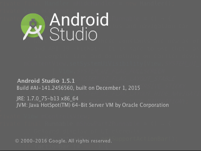
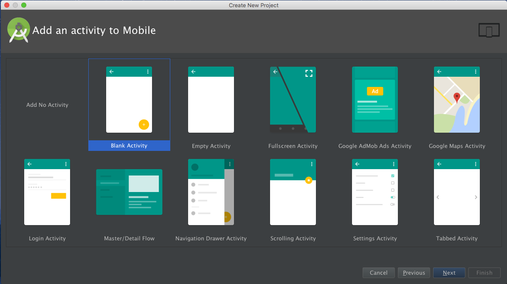
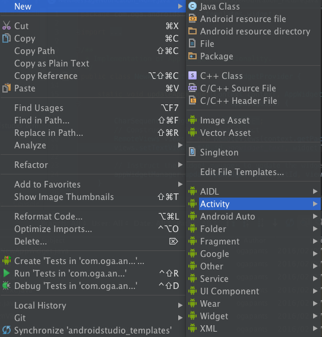

# AndroidStudio-Templates

This is a collection of templates of code that is automatically generated by the AndroidStudio.  
Please use when you want to reference the template code and movement.

# Now Version : 1.5.1

  
  
  

## Project info
* Created Date : 2015/12/09
* Android Studio version : 1.5.1
* Gradle Plugin : 1.5.0
* Gradle Wrapper : 2.8

## build.gradle info

* andorid
 * compileSdkVersion 23
 * buildToolsVersion "23.0.2"
 * minSdkVersion 16
 * targetSdkVersion 23

* dependencies
 * junit:4.12
 * com.android.support:appcompat-v7:23.1.1
 * com.android.support:design:23.1.1
 * com.android.support:support-v4:23.1.1
 * com.google.android.gms:play-services:8.4.0
 * com.google.android.gms:play-services-ads:8.4.0

## Contents

###[see](https://github.com/ogapants/AndroidStudio-Templates/tree/master/app/src/main/java/com/oga/androidstudio_templates)