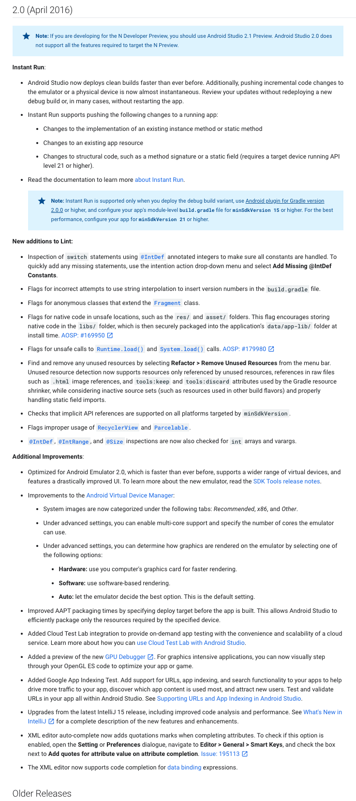
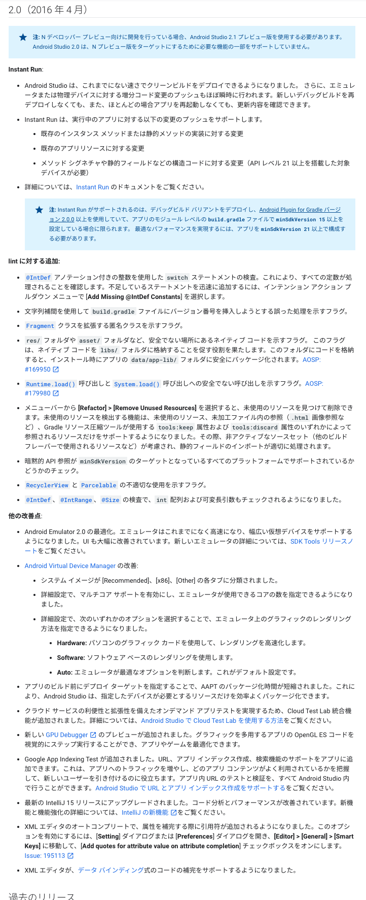

# AndroidStudio-Templates

This is a collection of templates of code that is automatically generated by the AndroidStudio.  
Please use when you want to reference the template code and movement.

## Now Version : 2.0
Android Developers Blog: Android Studio 2.0  
- [English](https://android-developers.googleblog.com/2016/04/android-studio-2-0.html)
- [Japanse](https://developers-jp.googleblog.com/2016/04/draft-android-studio-20.html)

  

## Versions
* Project
  * Created Date : April 2016
  * Gradle Plugin : 2.0.0
  * Gradle Wrapper : 2.10
* Andorid
  * compileSdkVersion 23
  * buildToolsVersion "23.0.3"
  * minSdkVersion 16
  * targetSdkVersion 23
* Dependencies
  * junit:4.12
  * com.android.support:appcompat-v7:23.3.0

## Release Note
### en
https://developer.android.com/studio/releases?hl=en#2-0-0  

### ja
https://developer.android.com/studio/releases?hl=ja#2-0-0  

### Diff
1.5 -> 2.0  
https://github.com/ogapants/AndroidStudio-Templates/pull/4/files